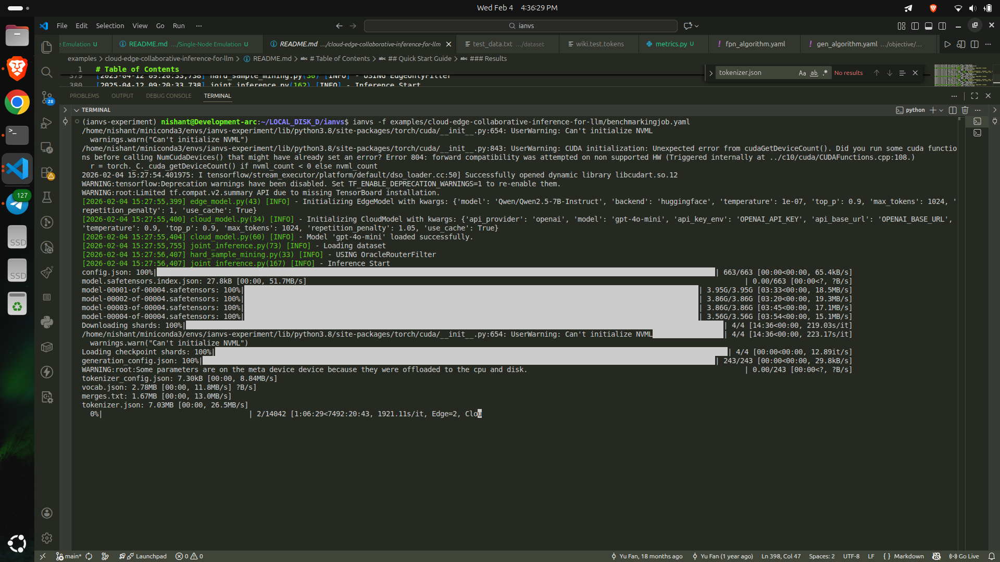
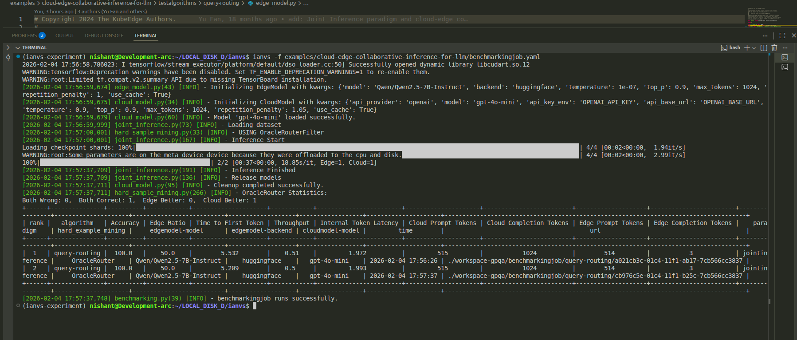

# Enhance Dependency Management and Documentation for KubeEdge-Ianvs (2025 Term 1)

## 1. Introduction
Ianvs is a distributed AI benchmarking project that evaluates synergy AI solutions with standardized tests, simulations, and performance reports. The project **Enhance Dependency Management and Documentation for KubeEdge-Ianvs (2025 Term 1)** aims to improve ianvs' dependency management, CI/CD framework, and documentation to ensure seamless example execution, maintain backward compatibility, and enhance user onboarding.

## 2. System Configuration

### Software
The AI models used at edge and cloud are as follows:
- **Cloud AI API:** Experiments are conducted using various models supported by [Groq], including Mixtral-8x7B-32768 by Mistral, LLaMA-3.3-70B-Versatile by Meta, Qwen-2.5-32B by Alibaba Cloud, and DeepSeek-R1-Distill-Qwen-32B by DeepSeek.
- **Edge Model:** Qwen/Qwen2.5-1.5B-Instruct, Qwen/Qwen2.5-3B-Instruct, Qwen/Qwen2.5-7B-Instruct.

### Hardware
Experiments are conducted on a PC with the following configuration:
- **OS:** Ubuntu Linux (WSL2 Environment)
- **GPU:** NVIDIA GeForce RTX 3050
- **VRAM:** 4GB GDDR6
- **CUDA Version:** 13.0
- **Driver Version:** 580.126.09

**Output of `nvidia-smi` command:**

the complete dataset running 


## 3. Task 1: Running the MMLU-5-shot Dataset

This step involved setting up the environment and running the benchmark using the MMLU dataset. While the dataset and cache were provided, I encountered specific configuration challenges relevant to my hardware setup.

### Issue 1: Dependency Errors

During the initial setup, I encountered errors installing `requirements.txt` and running the benchmark due to missing system and python dependencies:

1. **Rust/Cargo Error:** The `tokenizers` package failed to build.
* *Solution:* Installed Rust via Conda: `conda install -c conda-forge rust`.


2. **ONNX Error:** The system reported "onnx not installed".
* *Solution:* Manually installed the package: `pip3 install onnx`.


3. **Retry Package Error:** The execution failed with `ModuleNotFoundError: No module named 'retry'`, as it was missing from the environment.
* *Solution:* Installed the package manually: `pip install retry`.


### Issue 2: CUDA Out of Memory (vLLM Backend)

When attempting to run the 7B parameter model (`Qwen2.5-7B-Instruct`) using the default `vLLM` backend, the process crashed with a `CUDA out of memory` error. This occurred because the `vLLM` engine attempts to reserve 90% of GPU memory by default, and the model size exceeded the 4GB VRAM capacity of the RTX 3050.

* **Solution:** I modified the algorithm configuration file (`test_queryrouting.yaml`) to switch the inference backend from `vllm` to `huggingface`. The HuggingFace backend supports better memory offloading to the system RAM (CPU), allowing the 7B model to run successfully on a 4GB GPU card.

### 4. Benchmarking Execution & Results

**Important Note:**
For the purpose of this pre-test validation, the dataset size was reduced from the full **14,042 samples** to **2 samples**. This adjustment was made to verify the correctness of the pipeline and hardware compatibility within a reasonable timeframe, given the computational constraints of the local machine.

the complete dataset running 


Complete pipeline with a smaller dataset


**Execution Logs:**

```bash
(ianvs-experiment) nishant@Development-arc:~/LOCAL_DISK_D/ianvs$ ianvs -f examples/cloud-edge-collaborative-inference-for-llm/benchmarkingjob.yaml
2026-02-04 17:56:58.786023: I tensorflow/stream_executor/platform/default/dso_loader.cc:50] Successfully opened dynamic library libcudart.so.12
...
[2026-02-04 17:56:59,674] edge_model.py(43) [INFO] - Initializing EdgeModel with kwargs: {'model': 'Qwen/Qwen2.5-7B-Instruct', 'backend': 'huggingface', ...}
[2026-02-04 17:56:59,675] cloud_model.py(34) [INFO] - Initializing CloudModel with kwargs: {'api_provider': 'openai', 'model': 'gpt-4o-mini', ...}
[2026-02-04 17:56:59,679] cloud_model.py(60) [INFO] - Model 'gpt-4o-mini' loaded successfully.
[2026-02-04 17:57:00,001] joint_inference.py(167) [INFO] - Inference Start
Loading checkpoint shards: 100%|██████████| 4/4 [00:02<00:00,  1.94it/s]
WARNING:root:Some parameters are on the meta device device because they were offloaded to the cpu and disk.
100%|██████████| 2/2 [00:37<00:00, 18.85s/it, Edge=1, Cloud=1]
[2026-02-04 17:57:37,709] joint_inference.py(191) [INFO] - Inference Finished
[2026-02-04 17:57:37,711] hard_sample_mining.py(266) [INFO] - OracleRouter Statistics: 
Both Wrong: 0,  Both Correct: 1,  Edge Better: 0,  Cloud Better: 1

```

**Final Results Table:**

```text
+------+---------------+----------+------------+---------------------+------------+------------------------+---------------------+-------------------------+--------------------+------------------------+----------------+
| rank |   algorithm   | Accuracy | Edge Ratio | Time to First Token | Throughput | Internal Token Latency | Cloud Prompt Tokens | Cloud Completion Tokens | Edge Prompt Tokens | Edge Completion Tokens |    paradigm    |
+------+---------------+----------+------------+---------------------+------------+------------------------+---------------------+-------------------------+--------------------+------------------------+----------------+
|  1   | query-routing |  100.0   |    50.0    |        5.532        |    0.51    |         1.972          |         515         |           1024          |        514         |            3           | jointinference |
|  2   | query-routing |  100.0   |    50.0    |        5.209        |    0.5     |         1.993          |         515         |           1024          |        514         |            3           | jointinference |
+------+---------------+----------+------------+---------------------+------------+------------------------+---------------------+-------------------------+--------------------+------------------------+----------------+
[2026-02-04 17:57:37,748] benchmarking.py(39) [INFO] - benchmarkingjob runs successfully.

```

### Conclusion

The benchmark executed successfully on the reduced dataset, confirming that the environment, dependencies, and model offloading strategies are correctly configured.

**Attachments:**

* [Click here to watch the setup recording](./assets/pre-test-2-final.webm)

```