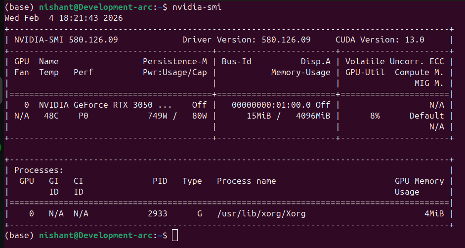
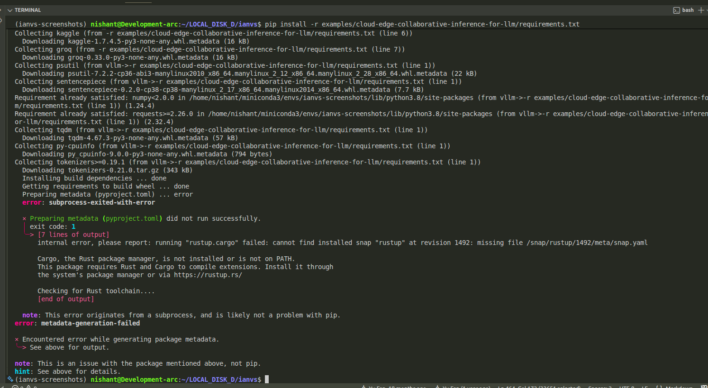
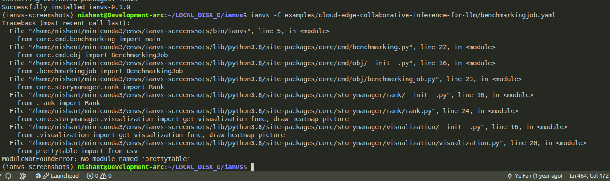
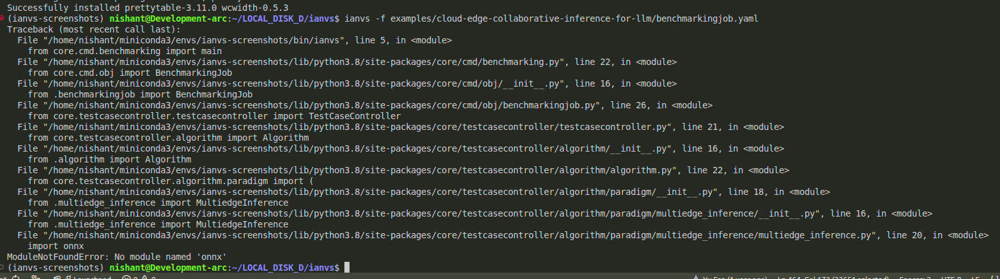
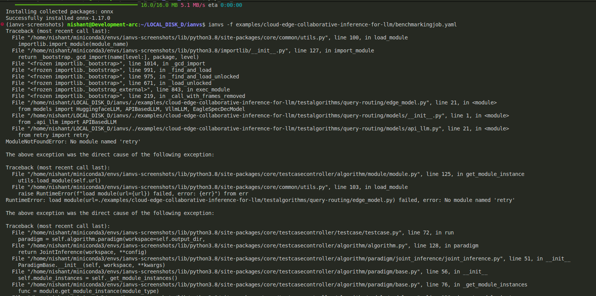

# Running Cloud-Edge LLM Example

## 1. Introduction

Ianvs is a distributed AI benchmarking project that evaluates synergy AI solutions with standardized tests, simulations, and performance reports. The project **Enhance Dependency Management and Documentation for KubeEdge-Ianvs (2025 Term 1)** aims to improve ianvs' dependency management, CI/CD framework, and documentation to ensure seamless example execution, maintain backward compatibility, and enhance user onboarding.

---

## 2. System Configuration

### 2.1 Software Requirements

**Cloud AI API:**
Experiments are conducted using various models supported by [Groq], including:
- Mixtral-8x7B-32768 by Mistral
- LLaMA-3.3-70B-Versatile by Meta
- Qwen-2.5-32B by Alibaba Cloud
- DeepSeek-R1-Distill-Qwen-32B by DeepSeek

**Edge Models:**
- Qwen/Qwen2.5-1.5B-Instruct
- Qwen/Qwen2.5-3B-Instruct
- Qwen/Qwen2.5-7B-Instruct

### 2.2 Hardware Specifications

Experiments are conducted on a PC with the following configuration:
- **OS:** Ubuntu Linux (WSL2 Environment)
- **GPU:** NVIDIA GeForce RTX 3050
- **VRAM:** 4GB GDDR6
- **CUDA Version:** 13.0
- **Driver Version:** 580.126.09

**Output of `nvidia-smi` command:**



---

## 3. Reproduction Steps

To replicate this experiment from scratch, execute the following commands. These steps include all fixes discovered during the troubleshooting process (detailed in Section 4).

```bash
# 1. These are the initia steps of cloning and creating the conda env for ianvs
git clone https://github.com/kubeedge/ianvs.git
cd ianvs

# 2. Create Environment (Python 3.8 + Rust is required)
conda create -n ianvs-experiment python=3.8 rust -c conda-forge -y
conda activate ianvs-experiment

# 3. Then I installed the deps, was not hard, faced a few hash errros but were solvable
pip install examples/resources/third_party/sedna-0.6.0.1-py3-none-any.whl

pip install -r requirements.txt

# 4. Installing the deps required for cloud-edge-collaborative-inference-for-llm and installing ianvs
python setup.py install
pip install -r examples/cloud-edge-collaborative-inference-for-llm/requirements.txt

# 5. Set Environment Variables
export OPENAI_BASE_URL="https://api.openai.com/v1"
export OPENAI_API_KEY="sk-proj-..."

# 6. Run Benchmark
ianvs -f examples/cloud-edge-collaborative-inference-for-llm/benchmarkingjob.yaml

# 6. During this time, 3 deps pretty-table, onnx and retry were absent so installed these
pip install onnx retry prettytable


```

---

## 4. Issues Encountered and Solutions

### 4.1 Dependency Errors

During the initial setup and execution in a fresh environment, multiple dependency failures were encountered. The `requirements.txt` provided in the example was insufficient to cover all system and Python package requirements for the benchmark.

#### Issue 1: Rust/Cargo Error (System Dependency)

The installation of `requirements.txt` failed immediately because the `tokenizers` library requires a Rust compiler to build extensions, which was not present in the base environment.

**Error:** `Cargo, the Rust package manager, is not installed or is not on PATH.`

**Solution:** Installed Rust via Conda: `conda install -c conda-forge rust`.



---

#### Issue 2: Prettytable Error (Missing Python Dependency)

After successfully installing requirements and attempting to run `ianvs`, the execution crashed due to a missing visualization library.

**Error:** `ModuleNotFoundError: No module named 'prettytable'`

**Solution:** Installed the package manually: `pip install prettytable`.



---

#### Issue 3: ONNX Error (Missing Python Dependency)

The benchmark failed again when initializing the `MultiedgeInference` paradigm, as the ONNX runtime was required but not installed.

**Error:** `ModuleNotFoundError: No module named 'onnx'`

**Solution:** Installed the package manually: `pip install onnx`.



---

#### Issue 4: Retry Package Error (Missing Python Dependency)

Finally, the Edge Model initialization failed because the API-based LLM module relies on the `retry` library, which was missing.

**Error:** `ModuleNotFoundError: No module named 'retry'`

**Solution:** Installed the package manually: `pip install retry`.



---

### 4.2 CUDA Out of Memory (vLLM Backend)

When attempting to run the 7B parameter model (`Qwen2.5-7B-Instruct`) using the default `vLLM` backend, the process crashed with a `CUDA out of memory` error. This occurred because the `vLLM` engine attempts to reserve 90% of GPU memory by default, and the model size exceeded the 4GB VRAM capacity of the RTX 3050.

**Solution:** Modified the algorithm configuration file (`test_queryrouting.yaml`) to switch the inference backend from `vllm` to `huggingface`. The HuggingFace backend supports better memory offloading to the system RAM (CPU), allowing the 7B model to run successfully on a 4GB GPU card.

---

## 5. Task 1: Running the cloud-edge-collaborative-inference-for-llm Dataset

### 5.1 Dataset Configuration

**Important Note:**
For the purpose of this pre-test validation, the dataset size was reduced from the full **14,042 samples** to **2 samples**. This adjustment was made to verify the correctness of the pipeline and hardware compatibility within a reasonable timeframe, given the computational constraints of the local machine.


### 5.2 Pipeline Execution

Complete pipeline with a smaller dataset:


---

## 6. Benchmarking Execution & Results

### 6.1 Execution Logs

```bash
(ianvs-experiment) nishant@Development-arc:~/LOCAL_DISK_D/ianvs$ ianvs -f examples/cloud-edge-collaborative-inference-for-llm/benchmarkingjob.yaml
2026-02-04 17:56:58.786023: I tensorflow/stream_executor/platform/default/dso_loader.cc:50] Successfully opened dynamic library libcudart.so.12
...
[2026-02-04 17:56:59,674] edge_model.py(43) [INFO] - Initializing EdgeModel with kwargs: {'model': 'Qwen/Qwen2.5-7B-Instruct', 'backend': 'huggingface', ...}
[2026-02-04 17:56:59,675] cloud_model.py(34) [INFO] - Initializing CloudModel with kwargs: {'api_provider': 'openai', 'model': 'gpt-4o-mini', ...}
[2026-02-04 17:56:59,679] cloud_model.py(60) [INFO] - Model 'gpt-4o-mini' loaded successfully.
[2026-02-04 17:57:00,001] joint_inference.py(167) [INFO] - Inference Start
Loading checkpoint shards: 100%|██████████| 4/4 [00:02<00:00,  1.94it/s]
WARNING:root:Some parameters are on the meta device device because they were offloaded to the cpu and disk.
100%|██████████| 2/2 [00:37<00:00, 18.85s/it, Edge=1, Cloud=1]
[2026-02-04 17:57:37,709] joint_inference.py(191) [INFO] - Inference Finished
[2026-02-04 17:57:37,711] hard_sample_mining.py(266) [INFO] - OracleRouter Statistics: 
Both Wrong: 0,  Both Correct: 1,  Edge Better: 0,  Cloud Better: 1
```

### 6.2 Final Results Table

```text
+------+---------------+----------+------------+---------------------+------------+------------------------+---------------------+-------------------------+--------------------+------------------------+----------------+
| rank |   algorithm   | Accuracy | Edge Ratio | Time to First Token | Throughput | Internal Token Latency | Cloud Prompt Tokens | Cloud Completion Tokens | Edge Prompt Tokens | Edge Completion Tokens |    paradigm    |
+------+---------------+----------+------------+---------------------+------------+------------------------+---------------------+-------------------------+--------------------+------------------------+----------------+
|  1   | query-routing |  100.0   |    50.0    |        5.532        |    0.51    |         1.972          |         515         |           1024          |        514         |            3           | jointinference |
|  2   | query-routing |  100.0   |    50.0    |        5.209        |    0.5     |         1.993          |         515         |           1024          |        514         |            3           | jointinference |
+------+---------------+----------+------------+---------------------+------------+------------------------+---------------------+-------------------------+--------------------+------------------------+----------------+
[2026-02-04 17:57:37,748] benchmarking.py(39) [INFO] - benchmarkingjob runs successfully.
```

---

## 7. Conclusion

The benchmark executed successfully on the reduced dataset, confirming that the environment, dependencies, and model offloading strategies are correctly configured.

---

## 8. Attachments

* [Click here to watch the setup recording](https://drive.google.com/file/d/1sMJDtIkpklD5vIRhJFmbCbMxcinAjfOv/view?usp=drive_link)