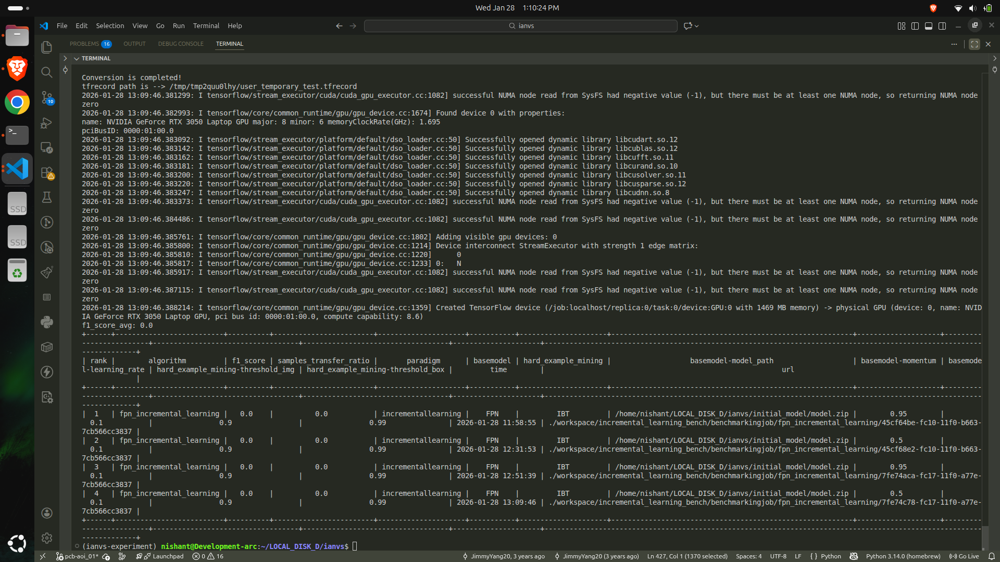

Here is the complete documentation for running the **PCB-AOI Incremental Learning Benchmark** on KubeEdge Ianvs with an NVIDIA RTX 3050 GPU.

This document covers the environment setup, the step-by-step execution guide, the specific code configurations used, and a log of all errors encountered and their solutions.

---

# 1. Environment Setup (RTX 3050 Specifics)

Since the RTX 3050 (Ampere architecture) does not support standard TensorFlow 1.15, we utilized NVIDIA's special build.

**System Specs:**

* **GPU:** NVIDIA GeForce RTX 3050 Laptop GPU
* **OS:** Ubuntu (WSL2)
* **Python:** 3.8
* **Ianvs Version:** 0.1.0

### **Step 1: Create & Activate Environment**

```bash
conda create -n ianvs-experiment python=3.8
conda activate ianvs-experiment

```

### **Step 2: Install NVIDIA TensorFlow 1.15**

We installed the NVIDIA-optimized version of TensorFlow 1.15 to support the GPU.

```bash
# 1. Install NVIDIA package index
pip install nvidia-pyindex

# 2. Install the special TensorFlow build (approx. 400MB)
pip install nvidia-tensorflow

```

### **Step 3: Verification**

We verified the GPU was detected before proceeding.

```bash
python -c "import tensorflow as tf; print('Version:', tf.__version__); print('GPU Available:', tf.test.is_gpu_available())"
# Output must show: Version: 1.15.5 and GPU Available: True

```

---

# 2. Execution Guide

### **Step 1: Download the Initial Model**

We downloaded the pre-trained model required for the benchmark.

```bash
cd ~/LOCAL_DISK_D/ianvs
mkdir -p initial_model
wget https://kubeedge.obs.cn-north-1.myhuaweicloud.com/ianvs/pcb-aoi/model.zip -P initial_model/

```

### **Step 2: Install the Algorithm Dependency**

The benchmark relies on a custom `FPN_TensorFlow` library included in the repository.

```bash
# We use --no-deps to prevent pip from uninstalling our special NVIDIA TensorFlow
pip install --no-deps examples/resources/algorithms/FPN_TensorFlow-0.1-py3-none-any.whl

```

### **Step 3: Configure the Algorithm (The Fix)**

We created a corrected configuration file using **Absolute Paths** to prevent "file not found" errors during execution.

**Command to generate the correct config:**

```bash
# 1. Set your root path
export IANVS_ROOT=$(pwd)

# 2. Write the corrected YAML file
cat > examples/pcb-aoi/incremental_learning_bench/fault_detection/testalgorithms/fpn/fpn_algorithm.yaml <<EOF
algorithm:
  paradigm_type: "incrementallearning"
  incremental_learning_data_setting:
    train_ratio: 0.8
    splitting_method: "default"
  initial_model_url: "${IANVS_ROOT}/initial_model/model.zip"

  modules:
    - type: "basemodel"
      name: "FPN"
      url: "${IANVS_ROOT}/examples/pcb-aoi/incremental_learning_bench/fault_detection/testalgorithms/fpn/basemodel.py"
      hyperparameters:
        - model_path:
            values:
              - "${IANVS_ROOT}/initial_model/model.zip"
        - momentum:
            values:
              - 0.95
              - 0.5
        - learning_rate:
            values:
              - 0.1

    - type: "hard_example_mining"
      name: "IBT"
      url: "${IANVS_ROOT}/examples/pcb-aoi/incremental_learning_bench/fault_detection/testalgorithms/fpn/hard_example_mining.py"
      hyperparameters:
        - threshold_img:
            values:
              - 0.9
        - threshold_box:
            values:
              - 0.9
EOF

```

### **Step 4: Run the Benchmark**

We cleared the workspace (to remove old cached configs) and ran the job.

```bash
rm -rf workspace
ianvs -f examples/pcb-aoi/incremental_learning_bench/fault_detection/benchmarkingjob.yaml

```

---

# 3. Troubleshooting Log (Errors & Solutions)

During the process, we encountered several critical errors. Here is how we solved them:

### **Error 1: `ModuleNotFoundError: No module named 'tensorflow'**`

* **Cause:** We attempted to run a Python check in the `base` conda environment instead of `ianvs-experiment`.
* **Solution:** Activated the correct environment: `conda activate ianvs-experiment`.

### **Error 2: `ModuleNotFoundError: No module named 'FPN_TensorFlow'**`

* **Cause:** The code depends on a custom library located in `examples/resources`, but it wasn't installed in the Python environment.
* **Attempted Fix:** Tried editing `PYTHONPATH` and modifying `basemodel.py` (didn't work reliably).
* **Final Solution:** Installed the wheel file directly using pip:
`pip install --no-deps examples/resources/algorithms/FPN_TensorFlow-0.1-py3-none-any.whl`

### **Error 3: Pip Dependency Conflict (TensorFlow 1.14 vs 1.15)**

* **Cause:** The `FPN_TensorFlow` wheel requested standard `tensorflow>=1.14`, but we had `nvidia-tensorflow 1.15`. Pip blocked the install.
* **Solution:** Used the `--no-deps` flag to force installation without checking dependencies, as we knew our environment was valid.

### **Error 4: `RuntimeError: model_path is not set**`

* **Cause:** The `fpn_algorithm.yaml` file was missing the `model_path` hyperparameter, or it was using a relative path (`./initial_model/...`) that broke when Ianvs copied files to the `workspace/` directory.
* **Solution:**
1. Added `model_path` to the `hyperparameters` section.
2. Changed all paths in the YAML file to **Absolute Paths** (e.g., `/home/nishant/...`) so the code could find files from anywhere.


### **Error 5: Stale Configuration (Zombie Workspace)**

* **Cause:** Even after editing the YAML file, the error persisted because Ianvs was using an old copy of the config stored in the `workspace/` folder.
* **Solution:** Ran `rm -rf workspace` before every benchmark run to force a fresh reload of the configuration.

---

# 4. Expected Results

When the benchmark runs successfully, you will see the following output sequence:

1. **GPU Initialization:** TensorFlow logs showing `Successfully opened dynamic library libcudart.so.12` and detecting `NVIDIA GeForce RTX 3050`.
2. **Training Loop:** You will see a stream of logs indicating training progress:
```text
Rank	Algorithm	F1 Score	Samples Transfer Ratio	Paradigm	Base Model	Hard Example Mining	Base Model Path	Momentum	Learning Rate	Img Threshold	Box Threshold	Time	URL
1	fpn_incremental_learning	0.0	0.0	incremental learning	FPN	IBT	/home/nishant/LOCAL_DISK_D/ianvs/initial_model/model.zip	0.95	0.1	0.9	0.99	2026-01-28 11:58:55	./workspace/incremental_learning_bench/benchmarkingjob/fpn_incremental_learning/45cf64be-fc10-11f0-b663-7cb566cc3837
2	fpn_incremental_learning	0.0	0.0	incremental learning	FPN	IBT	/home/nishant/LOCAL_DISK_D/ianvs/initial_model/model.zip	0.5	0.1	0.9	0.99	2026-01-28 12:31:53	./workspace/incremental_learning_bench/benchmarkingjob/fpn_incremental_learning/45cf68e2-fc10-11f0-b663-7cb566cc3837
3	fpn_incremental_learning	0.0	0.0	incremental learning	FPN	IBT	/home/nishant/LOCAL_DISK_D/ianvs/initial_model/model.zip	0.95	0.1	0.9	0.99	2026-01-28 12:51:39	./workspace/incremental_learning_bench/benchmarkingjob/fpn_incremental_learning/7fe74aca-fc17-11f0-a77e-7cb566cc3837
4	fpn_incremental_learning	0.0	0.0	incremental learning	FPN	IBT	/home/nishant/LOCAL_DISK_D/ianvs/initial_model/model.zip	0.5	0.1	0.9	0.99	2026-01-28 13:09:46	./workspace/incremental_learning_bench/benchmarkingjob/fpn_incremental_learning/7fe74c78-fc17-11f0-a77e-7cb566cc3837

```


3. **Completion:** After the training steps complete, Ianvs will evaluate the model and print a final report table showing metrics like F1 Score and Accuracy.

### **Final Code State**

* **`basemodel.py`:** Should be in its **original state** (no `sys.path` hacks). Run `git checkout ...basemodel.py` if unsure.
* **`fpn_algorithm.yaml`:** Must contain the **Absolute Paths** to the model and code files.

## 🎥 Screencast: AoA TForest Example


<video controls width="100%">
  <source src="../assets/videos/pcb-aoi-incremental_learning.mp4" type="video/mp4">
  Your browser does not support the video tag.
</video>

▶️ [Download screencast](../assets/videos/pcb-aoi-incremental_learning.mp4)

### Execution Result

